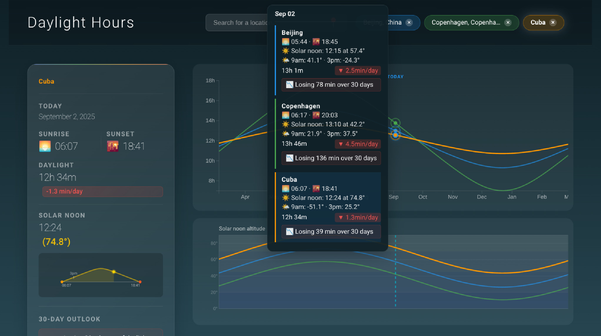

# Daylight Hours - Visualize sunrise, sunset, and daylight patterns throughout the year

See how daylight changes throughout the year for any location on Earth. Explore the rhythms of sunrise and sunset, discover when days are longest and shortest, and understand how latitude affects daylight patterns.

**[Try it live →](https://dnouri.github.io/daylight-hours/)**

## Features

**Interactive visualization** shows a full year of daylight data centered on today, making it easy to see seasonal patterns and upcoming changes.

**Compare multiple locations** simultaneously to understand how daylight varies across different latitudes - perfect for exploring how seasons differ around the world.

**Rate of change graph** reveals when daylight hours are changing most rapidly and when you're approaching the solstices.

**Local time display** automatically adjusts sunrise and sunset times to each location's timezone, showing you the actual times you'd experience there.

**Works offline** after first load, so you can check daylight patterns even without an internet connection.

**Mobile-friendly** design works seamlessly on phones, tablets, and desktops with an intuitive touch interface.

## Built With

- **D3.js** for interactive data visualization
- **SunCalc.js** for accurate astronomical calculations
- **OpenStreetMap Nominatim** for location search
- **Service Workers** for offline functionality
